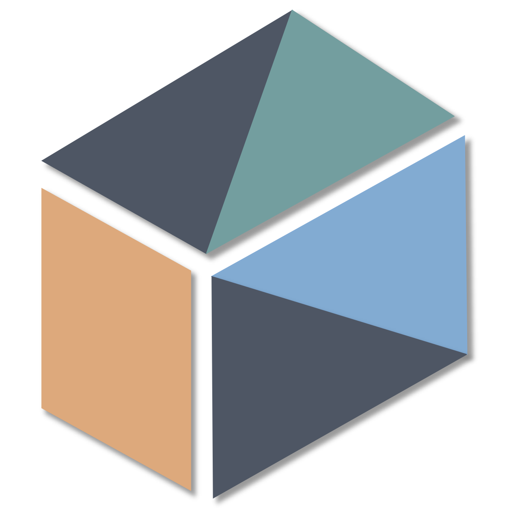

  

# Simplifying Kernel Fusion with Tile Processing

**TileFusion** is a highly efficient C++ macro kernel template library designed to elevate the level of abstraction in CUDA C for processing tiles. It is designed to be:

- **Higher-Level Programming**: TileFusion offers a set of device kernels for transferring tiles between the CUDA device's three memory hierarchies and for computing tiles.
- **Modularity**: TileFusion enables users to construct their applications by processing larger tiles in time and space using the provided BaseTiles.
- **Efficiency**: TileFusion offers highly efficient implementations of these device kernels.

TileFusion adopts a hardware bottom-up approach by building kernels around the core concept of the **BaseTile**. The shapes of these BaseTiles align with TensorCore's instruction shape and encapsulate hardware-dependent performance parameters to optimally utilize TensorCore's capabilities. Serving as building blocks, these BaseTiles are then combined to construct larger tiles in both temporal and spatial dimensions, enabling users to process larger tiles composed of BaseTiles for their applications.
